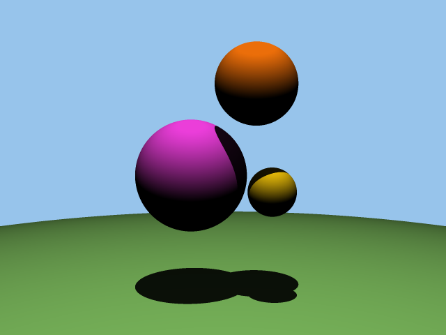

# Ray Tracing Renderer in C

This project is a 3D renderer implemented from scratch in C. It uses ray tracing techniques to generate images of spheres in 3D space, complete with realistic lighting, shadows, and anti-aliasing. The program reads input data describing the scene (camera, light, spheres, and colors) and outputs a rendered image in the PPM format.

## Features

- **3D Vector Operations:** Supports addition, subtraction, normalization, dot product, and more for 3D vectors.
- **Ray Tracing:** Casts rays from the camera to determine pixel colors based on sphere intersections.
- **Lighting and Shadows:** Simulates light sources and calculates shadows for realistic rendering.
- **Anti-Aliasing:** Smooths jagged edges by sampling each pixel multiple times.
- **PPM Image Output:** Renders the final image in the Portable Pixel Map (PPM) format.

## Code Structure

The project is organized into multiple files:

- **`vector.c`:** Implements 3D vector operations (addition, subtraction, normalization, etc.).
- **`spheres.c`:** Handles sphere data and intersection detection.
- **`color.c`:** Converts HEX colors to RGB and writes colors to the PPM file.
- **`main.c`:** Contains the main function and rendering logic.
- **`Makefile`:** Compiles the program and generates executables for different stages of development.

## How It Works

1. **Input:** The program reads a scene description from an input file, including:
   - Image dimensions (width and height).
   - Camera and viewport settings (viewport height, focal length).
   - Light properties (position and brightness).
   - Sphere data (position, radius, and color).
   - A list of colors in HEX format.

2. **Rendering Pipeline:**
   - For each pixel, a ray is cast from the camera through the viewport.
   - The program checks for intersections with spheres in the scene.
   - If a ray intersects a sphere, the color is calculated based on lighting and shadows.
   - If no intersection occurs, the background color is used.
   - Anti-aliasing is applied by sampling each pixel multiple times and averaging the results.

3. **Output:** The final image is saved as a PPM file, which can be viewed using any PPM-compatible image viewer.

## Example Input

640 480 
2.0 
1.0 
20.0 20.0 10.0 1000.0 
4 
0x1188EE 0xDD2266 0xDD7700 0x11CC66 
0 
3 
2.0 0.0 -5.0 2.0 2 
-2.0 0.0 -5.0 2.0 3 
0.0 -102.0 -5.0 100.0 1 

## Example Output

    

## Dependencies

- **C Compiler:** GCC or Clang.
- **Math Library:** Linked using `-lm` for square root calculations.
- **Make:** For building the project.
